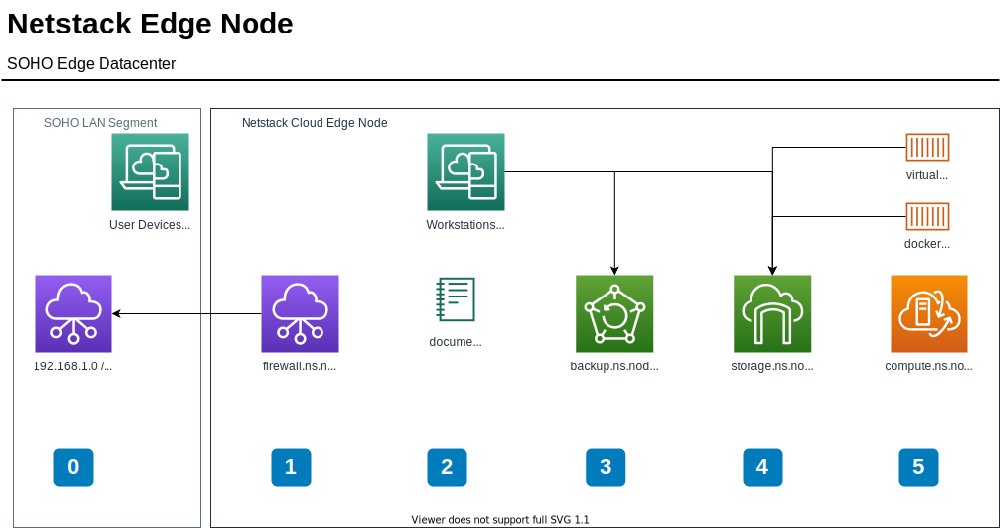

[documents index](../)

- [Netstack - freenas](./storage/freenas)
- [Netstack - freenas - setup](./storage/freenas/setup)
- [Netstack - NFS - Windows Client](./storage/windows)
- [Netstack - SMB - Windows Client](./storage/windows)

# LAN Overview

| IP | lan | purpose |
|----|-----|---------|
| [https://192.168.252.1](https://192.168.252.1) -> temp [https://192.168.253.254](https://192.168.253.254) | [https://ng.gh.lan](https://ng.gh.lan) | ng - network gateway | 
| [https://192.168.252.2](https://192.168.252.2) | [https://sg.gh.lan](https://sg.gh.lan) | sg - storage gateway | 
| [https://192.168.252.3](https://192.168.252.3) | [https://cg.gh.lan](https://cg.gh.lan) | cg - compute gateway | 
| [https://192.168.252.4](https://192.168.252.4) | [https://bg2.gh.lan](https://bg2.gh.lan) | bg - backups gateway secondary|
| [https://192.168.252.5](https://192.168.252.5) | [https://ng2.gh.lan](https://ng2.gh.lan) | ng - network gateway secondary| 
| [https://192.168.252.6](https://192.168.252.6) | [https://sg2.gh.lan](https://sg2.gh.lan) | sg - storage gateway secondary| 
| [https://192.168.252.7](https://192.168.252.7) | [https://cg2.gh.lan](https://cg2.gh.lan) | cg - compute gateway secondary| 
| [https://192.168.252.8](https://192.168.252.8) | [https://bg.gh.lan](https://bg.gh.lan) | bg - backups gateway |
| [https://192.168.252.9](https://192.168.252.9) | [https://dg.gh.lan](https://dg.gh.lan) | dg - documents gateway | 

Current netstack proceedure is to use [https://domains.google/](https://domains.google/) and [github pages](https://github.com) for community documents.  [Netstack https://netstack.org/docs](https://netstack.org/docs/)

## Netstack basics
Netstacks focuses on the three technology pilars.  The above network IP is an opinionated map for the primary gateways, secondaries, backups and documents.

- Pilar 1 - [Network - pfsense](./network/pfsense/) [pfsense.org](https://www.pfsense.org/)
- Pilar 2 - [Storage - freenas](./storage/freenas/) [freenas.org](https://www.freenas.org/)
- Pilar 3 - [Compute - xcp-ng](./compute/xcp-ng/) [xcp-ng.org](https://xcp-ng.org/)

## Netstack service
