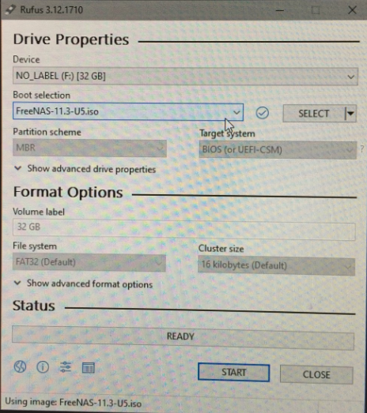
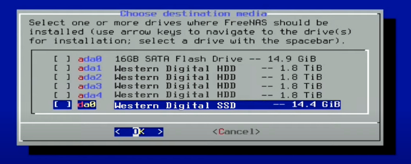
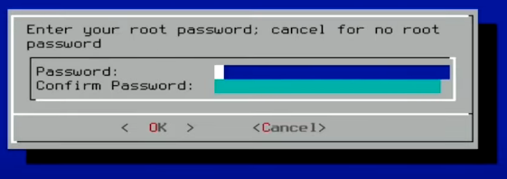

# freeNAS configuration


## freeNAS install 
1. Create [freeNAS install](https://web.freenas.org/download-freenas-release-112-113/) USB 3.0 Sandisk bootable thumbdrive using [Etcher - download](https://www.balena.io/etcher/k) or [Rufus - download](https://rufus.ie/)
    
2. Insert freeNAS install USB and a USB 3.0 Sandisk boot target or use a small SSD
    
    
3. Install... it will ask to set a root password
    
4. Pull freeNAS install USB and reboot
    


## freeNAS first pool setup

| Gateway purpose            | IP                                             | Local Domain Name                       |
|----------------------------|------------------------------------------------|-----------------------------------------|
| Network Management Gateway | [https://192.168.128.1](https://192.168.128.1) | [https://ng.ns.lan](https://ng.ns.lan)  |
| Storage Management Gateway | [https://192.168.128.2](https://192.168.128.2) | [https://sg.ns.lan](https://sg.ns.lan)  |
| Compute Management Gateway | [https://192.168.128.3](https://192.168.128.3) | [https://cg.ns.lan](https://cg.ns.lan)  |

----
1. Login to FreeNAS (root - yoursecurepassword)
2. View Dashboard check for any notifications
3. From FreeNAS Dashboard -> Storage -> Pools -> Add -> Create new pool
    - Name: nspool
    - Type: raidz2
    - Add Drives (the 4 disks) -> Set to raidz2 (default is raidz2)
4. Confirm Create (will delete all data)
5. Clean up Network
    - Hostname: sg
    - Domain: ns.lan
6. Add S.M.A.R.T. Test schedule to drives
    - Tasks - S.M.A.R.T. Test
    - Disks: (disk in each pool as a task) ada0, ada1, ada2
    - Type: LONG
    - Description: Monthly SMART test
    - Schedule: Montly (0 0 - -) First day of month at 12AM
7. Add SCRUB schedule to drives
    - Tasks - Scrub Tasks
    - Pool: nspool
    - Threshold days: 14
    - Description: Weekly Scrub

## freeNAS SMB Share Dataset Configuration

Groups

|   Group    | GID | Description |
|------------|------|-------|
| nsadmin    | 1009 | Netstack System Administration Group |
| nsbackup   | 1008 | Netstack Backup Group |
| nsprojects | 1001 | Netstack Projects Group  |
| nspublic   | 1000 | Netstack Public Group |


Users

| user    | UID  | Description |
|---------|------|------------------|
| root    |  0   |  only use on head |
| nsadmin |  1009   | only use in emergency |
| buadmin |  1008   | backup user for scripts |
| nsprouser | 1001 | basic project user template |
| nspubuser | 1000 | public share only user template |


1. Check Status of nspool [Storage - Pools - Gear Status](http://192.168.128.2/ui/storage/pools/status/1)
2. Add Projects dataset [Storage - Pools -> nspool -> Add Dataset](http:/192.168.128.2/ui/storage/pools/id/nspool/dataset/add/nspool)
      - Name: Projects
      - Comments: netstack Projects
      - Sync: Inherit (standard)
      - Compression: Inherit (lz4) (default)
      - Enable Atime: Inherit (on) (default)
      - ZFS Dedulication: Inherit (off) (default)
      - Case Sensitivity: Sensitive (default)
      - Share Type: Generic
      - SAVE
3. Add Public dataset [Storage - Pools -> nspool -> Add Dataset](http:/192.168.128.2/ui/storage/pools/id/nspool/dataset/add/nspool)
      - Name: Public
      - Comments: netstack Public share
      - Sync: Inherit (standard)
      - Compression: Inherit (lz4) (default)
      - Enable Atime: Inherit (on) (default)
      - ZFS Dedulication: Inherit (off) (default)
      - Case Sensitivity: Sensitive (default)
      - Share Type: Generic
      - SAVE
4. Create group nspublic [Accounts - Groups -> Add](http://192.168.128.2/ui/account/groups/add)
      - GID: 1000
      - Name: nspublic
      - SAVE
5. Create group nsprojects [Accounts - Groups -> Add](http://192.168.128.2/ui/account/groups/add)
      - GID: 1001
      - Name: nsprojects
      - SAVE
6. Create user nspubuser [Accounts - Users -> Add](http://192.168.128.2/ui/account/users/add)
      - Full Name: Netstack Public User
      - Username: nspubuser
      - Email: nspubuser@netstack.org
      - Password: somethingyouset
      - User ID: 1000
      - New Primary Group: unchecked - use nspublic as Primary Group
      - Primary Group: nspublic
      - Auxiliary Groups: none
      - Home Directory: /mnt/nspool/Public
      - Home Directory Permissions:
  
      |         | User | Group | Other |
      |---------|------|-------|-------|
      | Read    |   X  |   X   |   X   |
      | Write   |   X  |       |       |
      | Execute |   X  |   X   |   X   |
  
      - Authentication (leave default)
      - SAVE
      - Repeat for nsprouser but with nsprojects as primary group
7. Add Public SMB share [ Sharing - Windows Shares (SMB) - Add](http://192.168.128.2/ui/sharing/smb/add)
       - Path: /mnt/nspool/Public
       - Name: Public
       - Description: netstack Public SMB share
       - Enabled: yes - checked
       - Time Machine: no
       - Allow Guest Access: no
       - Enable Shadow Copies: yes - checked
       - SAVE
8. Edit ACL on Public Dataset [Storage - Pools - nspool - Public](http://192.168.128.2/ui/storage/pools/id/nspool/dataset/acl/nspool%2FPublic)
      - Path: /mnt/nspool/Public
      - User: root (default)
      - Group: nspublic (select from pulldown)
      - Apply Group: yes - Checked (need to check this to apply the group or it will not change)
      - Default ACL Options: OPEN
      - Apply Permissions Recursively: yes - Checked (good habbit when changing directories)
      - Save
9. Add Projects SMB share [ Sharing - Windows Shares (SMB) - Add](http://192.168.128.2/ui/sharing/smb/add)
       - Path: /mnt/nspool/Projects
       - Name: Projects
       - Description: netstack Projects
       - Enabled: yes - checked
       - Time Machine: no
       - Allow Guest Access: no
       - Enable Shadow Copies: yes - checked
       - SAVE
10. Edit ACL on Public Dataset [Storage - Pools - nspool - Projects](http://192.168.128.2/ui/storage/pools/id/nspool/dataset/acl/nspool%2FProjects)
  - Path: /mnt/nspool/Projects
  - User: root (default)
  - Group: nsprojects (select from pulldown)
  - Apply Group: yes - Checked (need to check this to apply the group or it will not change)
  - Default ACL Options: RESTRICTED
  - Apply Permissions Recursively: yes - Checked (good habbit when changing directories)
  - Save
11. RESTART SMB Service 
12. Test SMB connectivity on Windows
      - Windows Machine
      - File Browse to: \\192.168.128.2\ or sg.ns.lan
      - Network credentials: nspubuser - passwordyouset
      - Under Network > SG should see Projects and Public
      - Click on Public
      - Should be able to read and write files
      - Click on Project
      - Should NOT be able to access folder
13. Enable SMB Service [Services - SMB - Edit](http://192.168.128.2/ui/services/smb)a
      - Number of servers: 4 (each takes 1 core)
      - Allow no-root mount: Checked
      - Enable NFSv4: Checked
      - Restart NFS Service

## Windows 10 SMB Share browse
1. Open File Explorer
2. Type "\\sg.ns.lan" (or \\192.168.128.2) into path bar
3. Windows should request credentials
4. With correct credentials, File Explorer will display all datasets associated with server

## Windows 10 Map Network Drive
1. Right click on "This PC"
2. Select "Map network drive..."
    - Select Drive to map: "Z:"
    - Folder: "\\sg.ns.lan" (or \\192.168.128.2)
    - Reconnect at sign-in: checked (yes)
    - Connect using different credentials: checked (yes)
    - Enter credentials: nsprouser - thepasswordyouset
    - Finish
3. You should have access, you can edit or insert credentials directly see "Windows 10 credentials debug" below

## Windows 10 credentials debug
1. Search for "credentials" Select "Manage Windows Credentials Control panel" Application
    - Click Windows Credentials
    - Add, Edit or Remove the associated Windows Credentials
2. Clear Windows 10 local credentials
    - Press the Windows key + R together to open the Run box. Type the following command and hit Enter.
        ```
        rundll32.exe keymgr.dll, KRShowKeyMgr
        ```
    - Select and delete the credential

## Windows 10 bash mount Mounting DrvFs
In order to mount a Windows drive using DrvFs, you can use the regular Linux mount command. For example, to mount a removable drive D: as /mnt/d directory, run the following commands:
```
$ sudo mkdir /mnt/d
$ sudo mount -t drvfs D: /mnt/d
```
Now, you will be able to access the files of your D: drive under /mnt/d. When you wish to unmount the drive, for example so you can safely remove it, run the following command:
```
$ sudo umount /mnt/d
```
Mounting network locations
When you wish to mount a network location, you can of course create a mapped network drive in Windows and mount that as indicated above. However, it's also possible to mount them directly using a UNC path:
```
$ sudo mkdir /mnt/share
$ sudo mount -t drvfs '\\server\share' /mnt/share
```
Note the single quotes around the UNC path; these are necessary to prevent the need to escape the backslashes. If you don't surround the UNC path with single quotes, you need to escape the backslashes by doubling them (e.g. \\\\server\\share).

WSL does not have any way to specify which credentials to use to connect to a network share. If you need to use different credentials to connect to the server, specify them in Windows by navigating to the share in File Explorer, using the Windows Credential Manager, or the net use command. The net use command can be invoked from inside WSL (using net.exe use) via interop. Type net.exe help use for more information on how to use this command.

## Apple Mac Map Network Drive
Via Network Browse
1. Click Finder -> Network -> sg 
2. Click "Connect As" and enter credentials
3. Finder should show all resources on that server

Via GO
1. Click Finder GO -> "Connect to Server"
2. smb://sg.ns.lan (or smb://192.168.128.4)
3. Select the dataset you want to mount

## freeNAS NFS Share Dataset Configuration
1. Check Status of nspool [Storage - Pools - Gear Status](http://192.168.2.83/ui/storage/pools/status/1)
2. Add NFS_ISO_Share [Storage - Pools -> nspool -> Add Dataset](http://192.168.2.83/ui/storage/pools/id/nspool/dataset/add/nspool) [LT-video](https://youtu.be/k_gvwU15EyE?t=95)
  - Name: NFS_ISO_Share
  - Comments: NFS ISO files for LAN Share
  - Sync: Inherit (standard)
  - Leave rest default
  - SAVE
3. Edit Permissions on Projects Dataset [LT-video](https://youtu.be/k_gvwU15EyE?t=101)
  - Give Write to Group and Other
  - Apply Permissions Recursively
  - Save
4. Enable NFS Service [Services - NFS - Edit](http://192.168.2.83/ui/services/nfs) [LT-video](https://youtu.be/k_gvwU15EyE?t=222)
  - Number of servers: 4 (each takes 1 core)
  - Allow no-root mount: Checked
  - Enable NFSv4: Checked
  - Restart NFS Service
5. Turn off NFS Sync for each Dataset ZFS performance issue [LT-Video](https://youtu.be/k_gvwU15EyE?t=254)
```bash
root@freenas[/mnt/nspool]# ls
NFS_ISO_Share	Projects
root@freenas[/mnt/nspool]# zfs set sync=disabled nspool/Projects
root@freenas[/mnt/nspool]# zfs set sync=disabled nspool/NFS_ISO_Share
root@freenas[/mnt/nspool]# 
```
6. Create NFS share [Sharing - NFS - Add](http://192.168.2.83/ui/sharing/nfs/add) [LT-video](https://youtu.be/k_gvwU15EyE?t=117)
  - Path: /mnt/nspool/Projects
  - All dirs (checked)
  - Enabled (checked)
  - Advanced: Security: sys
  - Save
7. Create NFS share [Sharing - NFS - Add](http://192.168.2.83/ui/sharing/nfs/add) [LT-video](https://youtu.be/k_gvwU15EyE?t=117)
  - Path: /mnt/nspool/NFS_ISO_Share
  - All dirs (checked)
  - Enabled (checked)
  - Advanced: Security: sys
  - Save
8. Add the NFS share to your [xcp-ng server](../../compute/xcp-ng/)

## Reference Links
- [Etcher - download]:(https://www.balena.io/etcher/k)
- [Uncle Fester's Basic FreeNAS 9.10 Configuration Guide](https://www.familybrown.org/dokuwiki/doku.php?id=fester:intro)
- [FreeNAS Windows Shares](https://thesolving.com/storage/how-to-create-a-windows-share-with-freenas/)
- [FreeNAS Guides](https://thesolving.com/tag/freenas/)
- [How to clear Windows network credentials](https://www.top-password.com/blog/clear-saved-credentials-for-network-share-or-remote-desktop/#:~:text=Click%20the%20%E2%80%9CManage%20your%20credentials,Remove%20option%20to%20clear%20it.)

## Reference Videos
- [TrueNAS 12.0 download](https://download.freenas.org/12.0/MASTER/latest/x64/) 
- [TrueNAS core 12.0 Video](https://www.youtube.com/watch?v=KS6gVJnmy2U)
- [FreeNAS 11.3 download](https://www.freenas.org/download-freenas-release/) 
- [youtube - FreeNAS Smart Tests and Scrub Tests](https://www.youtube.com/watch?v=w0ZKuXN1AVM&vl=en)
- [youtube - How to Check SMART Information in FreeNAS](https://www.youtube.com/watch?v=PyBqahRsXwY)
- [youtube - tbd]()
- [youtube - Lawrence Systems - Open Source File Sync: Getting Started Tutorial With Syncthing on Windows & Linux](https://www.youtube.com/watch?v=O5O4ajGWZz8)
- [youtube - Lawrence Systems - Why We Use Syncthing, The Open Source Private File Syncing Tool instead of NextCloud](https://www.youtube.com/watch?v=bNiiJe8NpEw)
- [youtube - Lawrence Systems - FreeNAS 11 Rsync Server Setup](https://www.youtube.com/watch?v=Qhlp18QTUTo&t=359s)
- [youtube - Lawrence Systems - How To Setup NFS With FreeNAS and XenServer](https://youtu.be/k_gvwU15EyE)
- [youtube - Setting up FreeNAS 11 3 & SMB Basics](https://www.youtube.com/watch?v=__48uQ1ac6I)
- [youtube - - Lawrence Systems - FreeNAS 11.3 Windows Shares / File Sharing Permissions & ACL Configurations.](https://www.youtube.com/watch?v=dDs0DLj7J9w)

## Hindsight Jail
1. From FreeNAS Dashboard -> Jails -> ADD
  - Jail Name: hindsight
  - Release: 11.2-RELEASE
  - NEXT:
  - IPv4 Interface: em0
  - IPv4 Address: 192.168.1.6
  - IPv4 Netmask: 24
  - NEXT:
  - Confirm
```
Jail Summary
Jail Name : hindsight
Release : 11.2-RELEASE
IPv4 Address : em0|192.168.1.6/24
Confirm these settings.
```
2. Confirm 
  - Basic: Auto-Start
  - Jail: allow_set_hostname, allow_raw_sockets
3. Install hindsight - Jail -> hindsight -> shell
  - root@hindsight:~ # pkg install stow
  - root@hindsight:~ # mkdir /usr/local/stow
  - root@hindsight:~ # cd /usr/local/stow/
  - root@hindsight:~ # scp cat@192.168.1.30:/Users/cat/Downloads/hindsight_bsd_stow.tgz .
  - root@hindsight:~ # tar -xzvf hindsight_bsd_stow.tgz
  - root@hindsight:~ # vi /etc/rc.d/hindsight
```
$ cat /etc/rc.d/hindsight
#!/bin/sh
#
# PROVIDE: hindsight 
# REQUIRE: DAEMON
# KEYWORD: shutdown

. /etc/rc.subr

name=hindsight
rcvar=hindsight_enable

command="/usr/sbin/daemon"
command_args="-P /var/run/hindsight.pid -T hindsight /usr/local/bin/hindsight /usr/local/hindsight/hindsight.cfg 7"

load_rc_config $name

#
# DO NOT CHANGE THESE DEFAULT VALUES HERE
# SET THEM IN THE /etc/rc.conf FILE
#
hindsight_enable=${hindsight_enable-"NO"}
pidfile=${hindsight_pidfile-"/var/run/hindsight.pid"}

run_rc_command "$1"
```
  - root@hindsight:~ # chmod 555 /etc/rc.d/hindsight
  - root@hindsight:~ # vi /etc/rc.conf
```
 hindsight_enable="YES"
```
  - root@hindsight:~ # systemclt start hindsight
  - root@hindsight:~ # systemclt status hindsight
  - root@hindsight:~ # lsb_heka_cat /usr/local/hindsight/output/input/0.log
  - syslog collector is running on the standard port 514
  - pfsense collector is on port 4514

## Hindsight update
1. root@hindsight:~ # /etc/rc.d/hindsight status || (service hindsight status)
2. root@hindsight:~ # /etc/rc.d/hindsight stop || (service hindsight stop)
3. root@hindsight:~ # cd /usr/local/
4. root@hindsight:~ # scp cat@192.168.1.30:/Users/cat/Downloads/hs_bsd_stow.tgz .
5. root@hindsight:~ # stow -v -D *
6. root@hindsight:~ # rm -rf stow
7. root@hindsight:~ # tar -zxf hs_bsd_stow.tgz
8. root@hindsight:~ # cd stow
9. root@hindsight:~ # stow -v *
10. root@hindsight:~ # /etc/rc.d/hindsight start || (service hindsight start)
11. root@hindsight:~ # /etc/rc.d/hindsight status || (service hindsight status)
12. root@hindsight:~ # lsb_heka_cat /usr/local/hindsight/output/input/0.log
  
  
## Install new FreeNAS and import existing Pool
1. USB FreeNAS install to new USB
2. Login to FreeNAS firstime set pw (yoursecurepassword)
3. Storage -> Pools -> Add 
   - Import an existing pool
   - NEXT:
   - Is the pool encrypted? No
   - NEXT:
   - Pool: nspool
   - NEXT:
   - Confirm: IMPORT
```
Pool Import Summary
Pool to import : nspool | 9174643673441383865
Confirm these settings.
```
